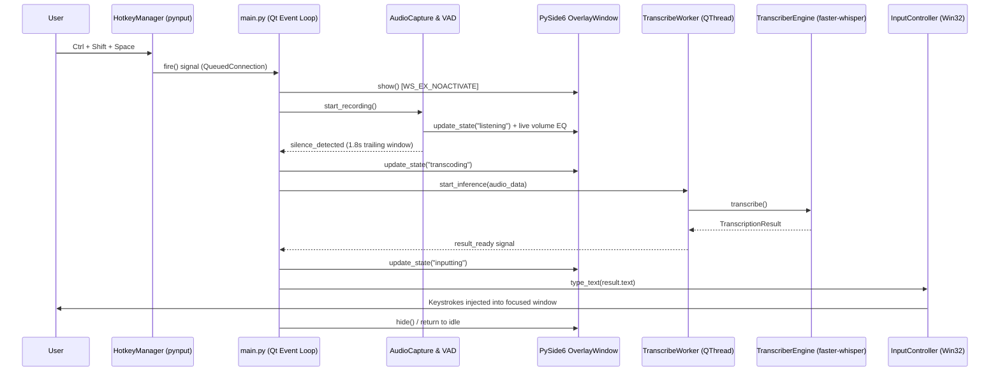

# 🎙️ Whisper STT (`stt-whisper`)

> **Local, GPU-accelerated speech-to-text dictation utility for Windows.**
> Press a global hotkey anywhere, speak in Korean or English, and watch your words get transcribed on-device and typed directly into your focused application window.

---


---

## ✨ Features

- 🔒 **100% On-Device & Private**: Powered by `faster-whisper` (CTranslate2). Audio processing runs 100% locally on your machine — zero cloud API costs, no network requests, and absolute data privacy.
- ⚡ **Global Hotkey Dictation**: Press <kbd>Ctrl</kbd> + <kbd>Shift</kbd> + <kbd>Space</kbd> from any application (VS Code, Windows Terminal, Notion, Discord, Web Browser) to start dictating instantly.
- 🛡️ **Win32 Keystroke Injection & UAC Auto-Elevation**: Auto-elevates via UAC at launch (`runas`) so keystroke injection (`SendInput`) works cleanly even inside Administrator terminals (bypassing UIPI privilege boundaries).
- 🎯 **2-Tier Silence Hysteresis & VAD**: 8-second initial grace period allows hesitation before talking; 1.8-second trailing silence promptly finishes recording after sentence completion.
- 🎨 **Non-Activating Floating HUD**: A frameless, translucent PySide6 overlay pill with live audio visualizer bars (`WS_EX_NOACTIVATE` window style so it never steals focus from your active editor).
- 🌐 **Dual Output Modes**:
  - **Transcribe Mode**: Korean / English transcribed as spoken.
  - **Translate Mode**: Korean speech translated into English text in real time.
- ⚙️ **Tray Menu & GUI Settings**: Easily configure GPU/CPU devices, beam size, low VRAM mode, and mic auto-off timers from the system tray.

---

## 🏗️ Architecture & Execution Pipeline



---

## 🚀 Quick Start

### 1. Prerequisites
- **OS**: Windows 10 / 11 (64-bit)
- **Python**: 3.10 or higher
- **GPU (Recommended)**: NVIDIA GPU with CUDA support for fast inference (CPU fallback supported)

### 2. Installation

Clone the repository and install dependencies using [`uv`](https://github.com/astral-sh/uv) (recommended) or `pip`:

```bash
# Clone repository
git clone https://github.com/savvy773/stt-whisper.git
cd stt-whisper

# Install virtualenv & dependencies with uv
uv sync

# Or with pip
python -m venv .venv
.venv\Scripts\activate
pip install -r pyproject.toml
```

### 3. Running the App

Launch the background system tray app (with silent window & crash logging):

```bash
pythonw whisper-stt.pyw
```

> **Note**: At first launch, Windows UAC will prompt for elevation to enable global keystroke injection across elevated Admin windows.

---

## ⌨️ Shortcuts & Usage

| Shortcut | Description |
|---|---|
| <kbd>Ctrl</kbd> + <kbd>Shift</kbd> + <kbd>Space</kbd> | Toggle voice recording / Stop recording & transcribe immediately |

---

## 📂 Project Structure

```
stt-whisper/
├── whisper-stt.pyw       # Pythonw entry point with UAC elevation & crash log hook
├── index.html            # Interactive web showcase / documentation page
├── settings.json         # Runtime user settings & persistence
├── pyproject.toml        # Project dependencies & build config
├── docs/
│   ├── ARCHITECTURE.md   # Architectural blueprint & design decisions
│   └── plan.md           # Roadmap & development history
└── src/
    └── whisper_stt/
        ├── main.py       # Qt main loop & event state machine
        ├── audio.py      # sounddevice mic capture & RMS silence hysteresis
        ├── transcriber.py  # CTranslate2 / faster-whisper model engine
        ├── input_controller.py # Win32 SendInput Unicode injection & clipboard fallback
        ├── hotkey.py     # pynput global keyboard shortcut listener
        └── hud/          # PySide6 translucent floating HUD & settings dialog
```

---

## 📄 License

This project is open source and available under the [MIT License](LICENSE).


