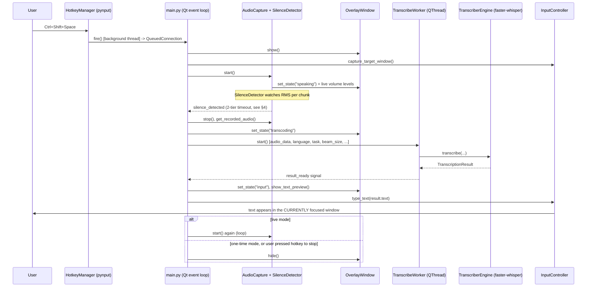

# Whisper STT — Architecture & Design Blueprint

This document is the authoritative reference for this project: what it is, how it works internally, how to install/configure/use it, and — for anyone (human or AI) picking this up cold — enough detail to rebuild it from scratch with the same design decisions and without repeating the mistakes already made and fixed once.

If you only read one file before touching this codebase, read this one.

---

## 1. What this is

A Windows tray app that turns a global hotkey into local, GPU-accelerated Korean/English speech-to-text dictation, typed directly into whatever window currently has focus. No cloud API, no network dependency for inference — everything runs on-device via `faster-whisper` (CTranslate2).

Core properties:
- **Local only.** Audio never leaves the machine. Model inference runs on the GPU (or CPU fallback).
- **Global.** Works in any app, any window — a terminal, a browser, a game — via a system-wide hotkey, not an in-app plugin.
- **Tray-resident.** No visible window at rest. A small HUD pill appears only while actively listening/processing, then disappears.
- **Two spoken-language-aware output modes.** Transcribe (Korean stays Korean) or Translate (Korean speech → English text), selectable live from the tray menu.

## 2. How it works — the pipeline



Everything left of "Engine" runs on the Qt main thread except the actual model inference, which runs in a dedicated `QThread` (`_TranscribeWorker`) so a multi-second decode never freezes the HUD or blocks the next hotkey press.

## 3. Module map

| File | Responsibility |
|---|---|
| `main.py` | Entry point. Wires every other module together via Qt signals/slots. Owns the single mutable pipeline state (`_AppState`), the hotkey→listen→transcribe→type state machine, tray icon, and settings restore/persist glue. This is the only file that should grow "business logic" — other modules stay narrow and reusable. |
| `config.py` | Compile-time constants (model id, sample rate, timing thresholds, paths). Nothing here is user-editable at runtime — user-editable knobs live in `settings.py` / `settings.json` instead. |
| `settings.py` | `SettingsManager` — a thin, lock-protected JSON key-value store at the project root (`settings.json`, **not** under `src/`). Every `.set()` call saves to disk immediately (no explicit "save" step needed elsewhere). |
| `audio.py` | `AudioCapture` (mic discovery, 16kHz resample pipeline, start/stop) and `SilenceDetector` (RMS-based end-of-utterance detection with hysteresis — see §4). Pure audio-domain logic, no Qt/UI dependency. |
| `transcriber.py` | `TranscriberEngine` — lazy-loads a single `faster-whisper` model, thread-locked so a device switch (GPU↔CPU) can't race a transcription. |
| `input_controller.py` | `InputController` — Win32 text injection. Two paths: direct `SendInput` (Unicode keyboard events, per-character), falling back to clipboard + `Ctrl+V` if injection is blocked. |
| `hotkey.py` | `HotkeyManager` — thin wrapper over `pynput.keyboard.GlobalHotKeys`. Fires a callback from a background thread; `main.py` bridges that into the Qt thread via a `QObject` signal with `QueuedConnection`. |
| `hud/overlay.py` | `OverlayWindow` — the visible pill: frameless, translucent, always-on-top, never steals focus (`WS_EX_NOACTIVATE`). Owns the `set_*` methods (`set_mode`, `set_output_lang`, `set_device`, `set_low_vram`, `set_beam_size`, `set_vad_filter`, `set_mic_timer`) and all the Qt signals main.py and `SettingsDialog` listen to/call. |
| `hud/settings_dialog.py` | `SettingsDialog` — one `QDialog`, one `QComboBox` per setting, opened from the tray's "Settings..." action (see §6). No state of its own; every combo just calls the matching `OverlayWindow.set_*` method. |
| `hud/widgets.py`, `hud/theme.py`, `hud/animations.py` | The HUD's individual visual components (status dot, volume EQ bars, mode badge, output badge, state label) and shared styling/animation helpers. |
| `whisper-stt.pyw` | The actual launched entry point. Resolves paths, self-elevates via UAC (see §7), sets up `sys.path`, then calls `main.main()`. Has its own crash-dialog exception hook so failures are visible instead of silently vanishing (pythonw has no console). |

## 4. Key design decisions (and why)

**Korean-only, transcribe-only.** The app no longer offers an English translate/output mode — `deepdml/faster-whisper-large-v3-turbo-ct2` (a CTranslate2 conversion of OpenAI's `whisper-large-v3-turbo`) is used purely for `task="transcribe"`. turbo's decoder is distilled to 4 layers (vs 32 on full large-v3), which measurably hurts translate-task quality — a non-issue now that translate isn't offered, but worth knowing if this model is ever repurposed for that task.

**Two-tier silence timeout, not one.** A single silence threshold can't serve two different needs at once:
- *Before the user has said anything*, they need a generous grace period (`MAX_WAIT_FOR_SPEECH_SEC`, 8s) to start talking after the hotkey press — otherwise the mic auto-closes on hesitation, which both cuts off real speech and causes the HUD to flicker Start→Stop→Start every ~2s forever if the room is quiet.
- *Once speech has started*, a short trailing-silence window (`SILENCE_THRESHOLD_SEC`, 1.8s) is what actually ends an utterance promptly.

`SilenceDetector.speech_detected` is the flag that switches between the two thresholds. This is *not* a total-recording-length cap — a hard cap on utterance length was tried and deliberately removed; natural pauses between sentences already segment a long live-mode session correctly, and an arbitrary cap only risks truncating a real long sentence.

**Type into whatever window is *currently* focused, not whatever was focused at hotkey-press time.** `InputController.type_text` checks `GetForegroundWindow()` live, at injection time — falling back to the window captured at recording-start only if the current foreground handle is invalid. Getting this backwards (prioritizing the captured handle) means dictation silently keeps typing into a stale window after the user alt-tabs away mid-recording. This exact bug has been (re)introduced and fixed twice across two different implementations of this app — it is the single easiest regression to reintroduce when touching this file.

**UIPI (User Interface Privilege Isolation) blocks keystroke injection into elevated windows.** If the focused target window (e.g. an Admin terminal) runs at a higher integrity level than this process, Windows silently drops `SendInput`/clipboard-paste events — this is an OS security boundary, not a bug, and every injector (AutoHotkey included) hits it. The fix is not a code workaround: `whisper-stt.pyw` self-elevates via UAC (`ShellExecuteW(..., "runas", ...)`) at launch so the injecting process always matches or exceeds the target's integrity level. `SendInput`'s return value (events actually queued) is checked per keystroke so a genuinely blocked injection falls back to clipboard paste instead of silently typing nothing.

**Per-character `SendInput` with a small delay, not one large batch.** Batching ~100+ keyboard events into a single `SendInput` call to save time regressed real typing — some target windows' message loops can't drain a large burst fast enough and silently drop keystrokes. One character (down+up) per call with a ~3ms pace is slower in theory but is the version that has actually been proven reliable across different target applications.

**`isinstance(x, bool)` must be checked before `isinstance(x, int)`.** Python's `bool` is a subclass of `int` (`True == 1`, `False == 0`). Any dispatch-by-type-then-value logic (e.g. the HUD menu's checkmark-sync code, which used to branch on `QAction.data()`) will silently misroute a `True`/`False` value into an int-range branch if the int check comes first. This bit the "VAD Noise Filter" menu once already (both On/Off appeared unchecked because `True` was being compared against beam-size values). When menu items across different submenus can share the same literal value (e.g. `beam_size=5` and "5 min" mic-off-timer both being `5`), dispatch by the submenu's identity/title, not by guessing from the value.

**HF Hub's automatic "is my cache stale?" check is bounded.** `huggingface_hub` pings the HF API on every model load to check if the cached model is still the latest revision (visible in logs as `httpx: GET .../revision/main`) — this is library-default behavior, not something this project added, and it already falls back to the local cache on a connection failure. `HF_HUB_ETAG_TIMEOUT` is set to 3s (default ~10s) purely so a flaky connection can't stall app startup.

**Settings persistence: distinguish "never set" from "explicitly disabled."** `None` and `0` both being falsy caused a real bug: selecting "disable the mic-off timer" (stored as `None`) was indistinguishable on reload from "no value saved yet," so it silently reset to the 10-minute default on every restart. Store the real value (`0` = explicitly disabled) and check `is not None` on restore, not plain truthiness. This class of bug (falsy-but-meaningful values) is worth watching for anywhere a setting's "off" state is a falsy Python value.

**Qt's `moveEvent` fires per-pixel, not per-drag.** Wiring anything expensive (a disk write, in this case — `settings.json` was being rewritten on every single pixel of HUD drag movement) to `moveEvent` instead of `mouseReleaseEvent` turns a single user gesture into hundreds of synchronous I/O calls. More generally: match the granularity of a persistence/side-effect call to the granularity of the user's actual intent, not to whichever Qt event happens to fire the most often.

**Background model warm-up, not eager-load-at-startup or pure lazy-load.** A synchronous model load at `main()` startup delays the tray icon appearing (the exact regression class already hit once via a blocking top-level `import whisper`). Pure lazy-load (load only inside the first `transcribe()` call) keeps startup instant but puts the multi-second model-load delay on the user's very first dictation attempt after every launch. `TranscriberEngine.warm_up()` is called from a daemon `threading.Thread` right after the engine is constructed — startup stays instant, and by the time the user finishes their first utterance the model is very likely already resident (same `self._lock` as `transcribe()`, so no race).

## 5. Installation

Prerequisites: Windows, Python 3.14 (`requires-python = ">=3.14"` in `pyproject.toml`), [`uv`](https://docs.astral.sh/uv/), and (optionally, for GPU acceleration) an NVIDIA GPU — no manual CUDA Toolkit install needed, the required CUDA runtime DLLs come from the `nvidia-cublas-cu12`/`nvidia-cudnn-cu12` pip wheels declared as dependencies.

```powershell
cd D:\Code\_toolkit\whisper
uv sync              # creates .venv/, installs everything from pyproject.toml + uv.lock
```

To rebuild the environment from scratch with the latest compatible dependency versions (dependencies are intentionally left unpinned except the two nvidia-cu12 floor versions, so this is the "stay current" command):

```powershell
Remove-Item -Recurse -Force .venv
uv sync --upgrade
```

Run it:

```powershell
.\whisper-stt.pyw
```

(or double-click it in Explorer). It will prompt for UAC elevation on every launch — this is deliberate, see §4. On first run it downloads the `deepdml/faster-whisper-large-v3-turbo-ct2` model from Hugging Face (~1.6GB) into the project's own `models/` folder (`MODEL_DIR`, not the global HF cache); subsequent launches just re-verify the cached revision (bounded to 3s, see §4) and load from disk.

A single-instance Windows named mutex (`Global\WhisperSTT_SingleInstance_Mutex`) prevents a second copy from running — launching while already running just shows a message box pointing at the existing tray icon.

## 6. Configuration

### `settings.json` (project root — **not** under `src/`)

This is the only settings file. (An old, unused, pre-refactor duplicate once existed at `src/whisper_stt/settings.json` with a completely different schema — it was dead code, never read, and has been deleted. If you ever see a second `settings.json` reappear under `src/`, it's stale; the real path is always `SETTINGS_PATH` from `config.py`, which resolves two parents up from `config.py` itself.)

```json
{
    "window_position": { "x": 906, "y": 1199 },
    "mode": "live",
    "mic_off_timer": 10,
    "device": "cuda",
    "low_vram": false,
    "beam_size": 5,
    "vad_filter": true,
    "input_language": "ko",
    "initial_prompt": "한국어 대화 및 영어 단어가 포함된 문장. 매끄러운 띄어쓰기 작성.",
    "silence_threshold_sec": 1.8,
    "silence_rms_threshold": 0.028
}
```

| Key | Meaning |
|---|---|
| `mode` | `"live"` (auto-relisten after each utterance) or `"once"` (one utterance, then idle). |
| `device` | `"cuda"` or `"cpu"`. Falls back to CPU automatically if no CUDA device is detected. |
| `low_vram` | `false` (plain `float16`, best accuracy) or `true` (`int8_float16` — int8-quantized weights, fp16 compute; roughly half the VRAM of plain float16 for a small accuracy cost). Only affects CUDA; CPU always uses `int8` regardless. Intended for ~8GB-class GPUs where turbo's ~1.6GB of float16 weights plus CUDA context + decode-time activations can get tight. Persists across device switches (cuda→cpu→cuda keeps the preference). |
| `beam_size` | `3` (balanced) or `5` (high accuracy). Benchmarked on an RTX 5070 Ti: effectively no latency difference once the model is warm (~0.28s either way for a short utterance) — 5 is the better default on any reasonably modern GPU. |
| `vad_filter` | Silero VAD noise filtering inside faster-whisper itself (separate from the RMS-based `SilenceDetector` in `audio.py`, which decides *when to stop recording* rather than *what counts as speech within* the recording). |
| `input_language` | Spoken language hint passed to Whisper. Forcing this (rather than `language=None` auto-detect) avoids language misdetection on short clips. |
| `initial_prompt` | A decoder context hint — tells Whisper to expect Korean conversation possibly containing English loanwords and to use natural spacing. Measurably improves Korean tokenization/spacing accuracy. |
| `silence_threshold_sec` / `silence_rms_threshold` | The trailing-silence cutoff and RMS speech-detection gate — see §4. |
| `mic_off_timer` | Minutes of total inactivity before the whole session force-idles. `0` = explicitly disabled (must be stored as `0`, not omitted/null — see §4). |

### Tray icon menu + Settings dialog

The tray icon's right-click menu is deliberately short — three items:

- **Show / Hide HUD** — manually toggle HUD visibility (also force-idles the mic session when hiding).
- **Settings...** — opens `hud/settings_dialog.py`'s `SettingsDialog`, a plain `QDialog` with one `QComboBox` row per setting (Mode, Device, GPU Memory, Quality, VAD Noise Filter, Mic Off Timer), each pre-selected to the current value. There is no Save button — every combo's `currentIndexChanged` calls straight through to the matching `OverlayWindow.set_*` method (`set_mode`, `set_device`, `set_low_vram`, `set_beam_size`, `set_vad_filter`, `set_mic_timer`), which updates state, emits the same signal the rest of the app already listens to, and persists via the usual `settings.set(...)` path — identical behavior to every other change path in the app, just reached through one window instead of nested submenus. `main.py` keeps a single instance and raises it (`show()`/`raise_()`/`activateWindow()`) rather than creating a new dialog on every click.
- **Exit App**

This replaced an earlier design where all seven settings were nested `QMenu`s flattened directly onto the tray's top-level menu (~228px tall, 7 items + submenus) — navigating it meant re-opening the tray menu and drilling into a submenu per change.

`main.py` uses `tray_icon.setContextMenu(tray_menu)` — the Windows shell requires a `SetForegroundWindow`-style handoff immediately before showing a tray icon's context menu, or clicks inside it silently don't register (the menu appears but nothing happens when an item is clicked). `setContextMenu()` handles that correctly internally; an earlier attempt to manually position the menu via `tray_menu.popup(QPoint(...))` (to guarantee it opened upward and never got clipped by the taskbar) skipped that handoff and broke "Settings..." entirely — clicking it did nothing, with no error, since `whisper-stt.pyw` runs under `pythonw.exe` and any traceback would go to a stderr nobody sees. Reverted to `setContextMenu()`; the now-3-item menu is short enough that taskbar clipping isn't a realistic concern anyway. `tray_menu.setStyleSheet(theme.get_stylesheet())` is also called explicitly — a standalone `QMenu()` with no parent doesn't inherit `overlay`'s stylesheet by cascade, so the tray menu had actually never been picking up the app's dark theme QSS at all until this was added.

## 7. Usage

- **`Ctrl+Shift+Space`** (or **`Ctrl+Alt+Space`**) anywhere on the system: the HUD appears and starts listening. Speak; after ~1.8s of silence it transcribes and types the result into whatever window currently has focus — even if you've switched windows since you started speaking. In live mode it then automatically starts listening again; press the hotkey again (or wait through one-time mode) and the HUD disappears back into the tray.
- **HUD is not visible at rest.** It only exists on screen while a session is active; the app is otherwise a plain tray icon.
- **Dragging the HUD** repositions it; the new position is saved when the app quits (not continuously — see §4).
- All configuration changes take effect immediately and are saved to `settings.json` on every change (no separate "save" step, no restart required for any setting).

## 8. Extending this project

When asked to change this app, the module map in §3 tells you where the change belongs — resist adding UI-adjacent logic to `main.py` for something that's really an `audio.py`/`transcriber.py` concern, and resist adding business logic to `hud/*` for something that's really `main.py`'s job (the HUD should stay a dumb, signal-driven view).

Before adding a new safety/robustness mechanism (a timeout, a hard cap, a retry), check whether the user has already told you how they actually use the feature — see the `MAX_RECORDING_SEC` lesson in §4. A cap that solves a hypothetical edge case can conflict with how someone actually works, and got explicitly rejected once already.

Before touching `input_controller.py` or the hotkey→listen→transcribe→type state machine in `main.py`, re-read §4's notes on window-focus and UIPI — these are the two things most likely to silently regress.
